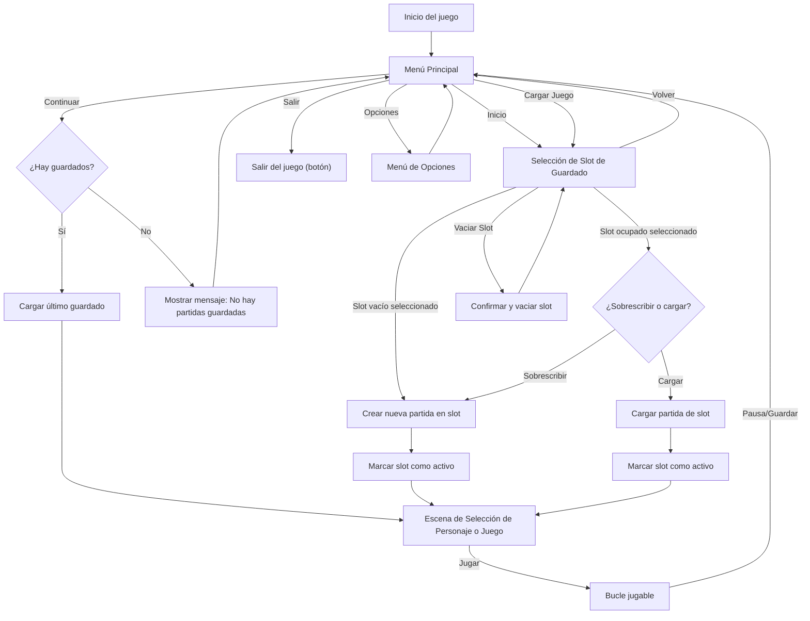

# Flujo de Menús y Sistema de Guardado

## Diagrama del Flujo Final

---

## Especificaciones y advertencias

- **El botón "Salir" del menú principal está diferenciado del cierre de ventana (aspa roja):**
  - El botón "Salir" ejecuta lógica interna y deja un log específico: `[Menu] Botón Salir pulsado - Cierre solicitado por el usuario desde el menú`.
  - El cierre de ventana deja un log distinto: `[Sistema] Cierre de ventana detectado - Evento de sistema`.
- El slot de guardado activo se recuerda y se muestra en la interfaz.
- Se puede vaciar cualquier slot desde el menú de selección.
- El archivo de guardado seleccionado queda "vivo" para escritura continua.

---

## Cambios implementados

- Unificación de "Nuevo juego" y "Cargar juego" en "Inicio".
- Menú de selección de slot funcional y visual.
- Diferenciación clara entre botón Salir y cierre de ventana.
- Documentación y diagrama actualizados.

---

## Política de saltos de línea y tabulaciones

- Todos los archivos `.py`, `.md`, `.json`, `.txt` usan saltos de línea `LF` en el repositorio (ver `.gitattributes`).
- La indentación es SIEMPRE con tabulaciones.
- Si editas en Windows, puedes configurar tu editor para ver los saltos de línea correctamente.

---

## Registro de restauración y advertencia

- **Fecha:** 2024-12-19
- Se restauró el proyecto tras un incidente que eliminó los saltos de línea en todos los archivos de texto.
- Se recuperó el flujo avanzado de menús y guardado, y se reforzaron las políticas de formato:
  - Tabulaciones para indentación en todos los scripts Python.
  - Saltos de línea LF forzados en el repositorio mediante `.gitattributes`.
- Se diferencia explícitamente en los logs el cierre por botón "Salir" y el cierre de ventana/aspa roja.
- Documentación y diagrama actualizados para futuras referencias.

> **Advertencia:** Si se detecta cualquier alteración masiva de formato, restaurar desde el control de versiones antes de continuar el desarrollo.

_Actualizado automáticamente tras recuperación y refactorización crítica (2025-07-29)._
